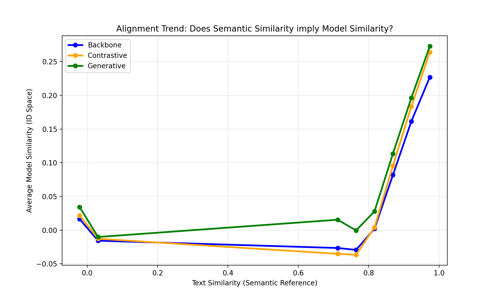
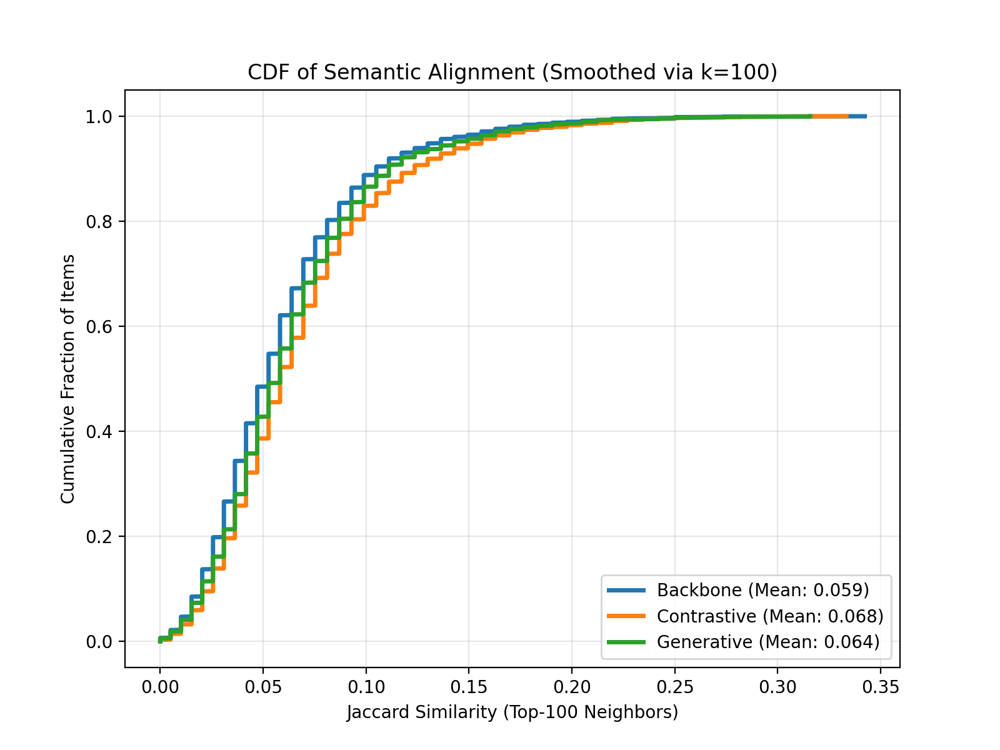
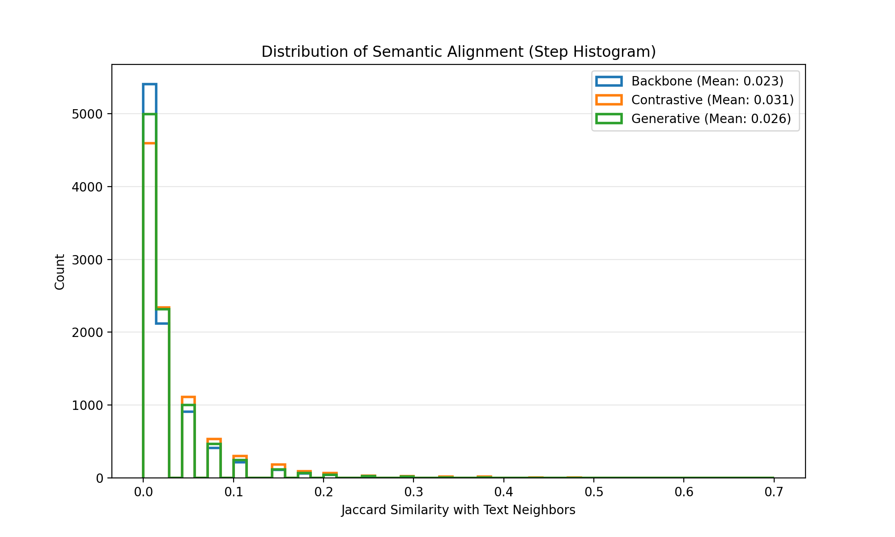
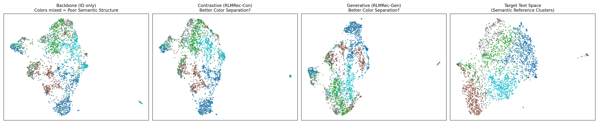

# Quantifying Representation Learning with Large Language Models for Recommendation (Demo)

Audience: UC Santa Barbara CS291A (Instructor: Tao Tyang)

This document summarizes the key analysis graphs for one of our data set: *the Amazon dataset* using the GCCF model, with brief explanations of the axes and what each figure shows.

---

## 1) Alignment Trend

- X-axis: True Text Similarity (semantic reference) — meaning: how similar two items are based on their content/LLM text embeddings (higher = more semantically alike).
- Y-axis: Model ID Similarity — meaning: how similar the model believes those items are in the learned ID embedding space (higher = closer in recommendations).
- Overall meaning: Tests whether the model’s ID space reflects true semantic similarity. A steeper, rising curve (Contrastive) means as two items become more similar in text, the model also treats them as similar in IDs.

---

## 2) Jaccard CDF

- X-axis: Jaccard similarity (0–1) — meaning: how much the model’s recommendations overlap with the semantic reference recommendations (0 = no overlap, 1 = perfect overlap).
- Y-axis: Cumulative percentage of items — meaning: for a given Jaccard value, the proportion of items whose recommendation overlap is at or below that value.
- Overall meaning: Measures recommendation quality via overlap with semantic reference lists. Curves farther to the right indicate better semantic alignment (Contrastive > Backbone).

---

## 3) Jaccard Histogram (Step)

- X-axis: Jaccard similarity bins — meaning: grouped ranges of overlap between the model’s recommendations and the semantic reference lists.
- Y-axis: Frequency (count or proportion) — meaning: how many items fall into each overlap range.
- Overall meaning: Complements the CDF by showing how overlap is distributed. Right‑shifted peaks mean stronger agreement with semantic reference.

---

## 4) UMAP Semantic Clusters

- X-axis / Y-axis: UMAP components — meaning: 2D coordinates from UMAP that project high‑dimensional item embeddings into a plane while preserving neighborhood structure.
- Overall meaning: Items are colored by genre from the semantic reference. Better separation (Contrastive) shows the model organizes items by content meaning, not just co‑purchase patterns.

---

## Notes

- Jaccard similarity: |A ∩ B| / |A ∪ B|, measures overlap between two sets.
- UMAP: Uniform Manifold Approximation and Projection; non‑linear dimensionality reduction for visualizing high‑dimensional spaces.
- Alignment: Here means agreeing the ID space with the Text space so similar content is also similar in IDs.

